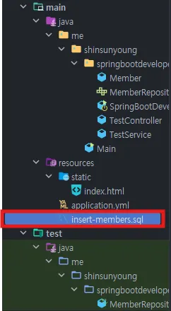
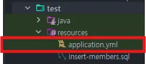
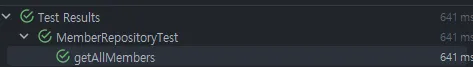
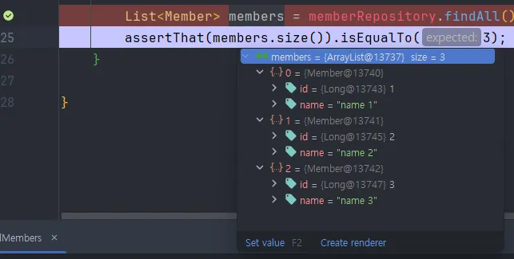

# 4장 테스트

## 4.1 테스트 코드 개념

테스트 코드란 개발자가 작성한 코드가 의도한 대로, 문제 없이 잘 돌아가는지 확인하는 코드이다. 이를 통해 유지보수성을 높이고 코드가 돌아가지 않을까 걱정하지 않아도 된다.

### 테스트 코드란

`테스트 코드의 given-when-then`

given : 테스트 실행을 준비하는 단계

when : 테스트를 준비하는 단계

then : 테스트 결과를 검증하는 단계

## 4.2 테스트

> 스타터 테스트 목록
>
- `Junit` : 테스트 프레임워크
- `AssertJ` : 검증문인 어설션을 작성하는데 사용되는 라이브러리
- `Hamcrest` : Matcher 라이브러리. 표현식을 이해하기 쉽게 만드는데 사용됨
- `Mockito` : 테스트에 사용할 가짜 객체인 목(Mock) 객체를 쉽게 만들고 관리하고, 검증할 수 있게 만드는 프레임워크
- `JSONassert` :JSON용 어설션 라이브러리
- `JsonPath` : JSON 데이터에서 특정 데이터를 선택하고 검색하기 위한 라이브러리

### Junit이란

Junit은 메소드 단위를 테스트하고 검증하는 테스트 프레임워크다. Junit의 테스트 방식을 구분할 수 있는 `@Test` 에너테이션으로 메소드를 호출할 때마다 객체를 생성하여 독립적인 테스트를 시행할 수 있게 해준다.

**Junit으로 단위 테스트 코드 만들기**

```java
@DisplayName("1 + 2는 3이다")
@Test
public void junitTest() {
    int a = 1;
    int b = 2;
    int sum = 3;
    Assertions.assertEquals(sum, a + b);
}
```

- `@DisplayName` : 테스트의 이름 명시
- `@Test` : 해당 메소드를 테스트를 수행하는 객체로 만듦
- `assertEquals()` 로 a+b와 sum의 값이 같은지 확인한다. 인자로 비교할 값들을 넣어 메소드를 사용한다.

```java

    @BeforeEach
    public void beforeEach() { System.out.println("Hello!");}
    
    @AfterAll
    public static void afterAll() {
        System.out.println("Bye!");
    }
    
    @Test
    public void junitQuiz3() {
        System.out.println("This is first test");
    }
    
    @Test
    public void junitQuiz4() {
        System.out.println("This is second test");
    }
```

- `@BeforeAll` : 전체 테스트를 시작하기 전에 처음 한 번만 시작한다.
- `@BeforeEach` : 테스트 케이스를 시작하기 전에 매번 실행한다. 해당 에너테이션을 통해 테스트에 사용하는 객체를 초기화하거나 테스트에 필요한 값을 미리 넣을 때 사용할 수 있다.
- `@AfterAll` : 전체 테스트를 마치고 종료하기 전에 한 번만 실행한다. 전체 테스트에서 한 번만 실행되어야 하므로 static으로 실행된다.
- `@AfterEach` : 각 테스트를 종료 전 실행한다. 특정 테스트 이후, 데이터를 삭제해야할 때 사용한다.

```
Hello!
This is first test
Hello!
This is second test
Bye!
```

**AssertJ로 검증문 가도성 높이기**

Assertion은 기댓값과 비교값이 잘 구분되지 않는다.

```java
Assertions.assertEquals(sum, a + b);
```

이러한 Assertion의 가독성을 높인 것이 AssertJ이다.

```java
assertThat(a + b).isEqualTo(sum);
```

이와 같이 isEqualTo() 메소드를 통해 보다 가독성이 높다.

| 메서드 이름 | 설명 |
| --- | --- |
| isEqualTo(A) | A 값과 같은지 검증 |
| isNotEqualTo(A) | A 값과 다른지 검증 |
| contains(A) | A 값을 포함하는지 검증 |
| doesNotContain(A) | A 값을 포함하지 않는지 검증 |
| startsWith(A) | 접두사가 A인지 검증 |
| endsWith(A) | 점미사가 A인지 검증 |
| isEmpty() | 비어있는 값인지 검증 |
| isNotEmpty() | 비어 있지 않은 값인지 검증 |
| isPositive() | 양수인지 검증 |
| isNegative() | 음수인지 |
| isGreaterThan(A) | A 보다 큰 값인지 검증 |
| isLessThan(A) | A 보다 작은 값인지 검증 |

## 4.3 테스트 코드 작성

```java
@SpringBootTest
@AutoConfigureMockMvc
class TestControllerTest {
    @Autowired
    protected MockMvc mockMvc;

    @Autowired
    private WebApplicationContext context;

    @Autowired
    private MemberRepository memberRepository;
    @BeforeEach
    public void mockMvcSetUp() {
        this.mockMvc = MockMvcBuilders.webAppContextSetup(context)
                .build();
    }
    @AfterEach
    public void cleanUp() {
        memberRepository.deleteAll();
    }

    @DisplayName("getAllMembers: 아티클 조회에 성공한다.")
    @Test
    public void getAllMembers() throws Exception {
        // given
        final String url = "/test";
        Member savedMember = memberRepository.save(new Member(1L, "홍길동"));

        // when
        final ResultActions result = mockMvc.perform(get(url)
                .accept(MediaType.APPLICATION_JSON));

        // then
        result
                .andExpect(status().isOk())
                .andExpect(jsonPath("$[0].id").value(savedMember.getId()))
                .andExpect(jsonPath("$[0].name").value(savedMember.getName()));
    }
}
```

**어노테이션**

`@AutoConfigureMockMvc`

MockMvc를 생성하고 자동으로 구성한다. MockMvc란 어플리케이션을 서버에 배포하지 않고도 MVC환경을 만들어 요청/전송/응답 기능을 제공하는 유틸리티 클래스이다.  컨트롤러 테스트 이기도 하다.

**mockMvc 메소드**

1. `perform()` 메서드는 요청 전송 역할을 맡은 메소드이다. 결과로는 ResultActions객체를 얻게 되는데, 이는 반환값을 검증학도 확인하는 andExpect() 메서드를 제공한다.
2. `accept()` 메서드는 요청을 보낼 때 무슨 타입으로 응답을 받을지 결정하는 메소드이다.
3. `andExpect()` 메서드는 응답을 검증한다. TestController에서 만든 API응답으로 OK(200)을 반환하므로 isOk를 사용해 OK(200)인지 확인한다.

<br/>

# 5장 ORM

## 5.1 데이터베이스란?

### DBMS

Database Management System은 많은 사람들이 DB를 동시 접근할 수 있게 하며 DB관리를 효율적으로 하는 소프트웨어이다. DBMS에 따라 관계형, 객체-관계형, 도큐먼트형, 비관계형으로 분류되며, 가장 널리 사용되는 것은 관계형이다.

### 관계형 DBMS

Relatoinal DBMS 는 테이블로 데이터베이스를 관리한다. 테이블에는 고유의 키와 값이 존재한다.

`<user테이블>`

| ID | email | age |
| --- | --- | --- |
| 1 | abc@test.com | 20 |
| 2 | def@test.com | 30 |
| 3 | ghi@test.com | 40 |

위와 같이 `{ 1, abc@test.com, 20}` 을 묶어서 한 줄을 행이라고 하며, ID, email, age각각 열이라고 한다.

### SQL 문

**SELECT**

테이블 조회용 쿼리문이다. SELECT문의 문법은 아래와 같다.

```sql
SELECT <가져올 컬럼 명>
  FROM <가져올 테이블 명>
 WHERE <조건>
```

위 user테이블에서 ID가 2인 사람의 이메일을 가져오는 쿼리문은 아래와 같다.

```sql
SELECT email
  FROM user
 WHERE ID = 2;
```

**WHERE**

조건을 넣어주는 구절이다.

**INSERT**

데이터를 추가하는 구절이다.

```sql
INSERT INTO <테이블명(넣어줄 속성명)>
VALUES <넣어줄 값>
```

위 유저 테이블에 {email: jkl@test.com , age: 50} 인 행을 추가해보자.

```sql
INSERT INTO user(email, age)
VALUES (jkl@test.com, 50);
```

그럼 아래와 같은 결과가 나온다.

`<user테이블>`

| ID | email | age |
| --- | --- | --- |
| 1 | abc@test.com | 20 |
| 2 | def@test.com | 30 |
| 3 | ghi@test.com | 40 |
| 4 | jkl@test.com | 50 |

**DELETE**

```sql
DELETE FROM <테이블명>
 WHERE <조건>;
```

행을 지울 때 사용된다. 방금 추가된 정보를 지워보자.

```sql
DELETE FROM user
 WHERE age = 50;
```

`<user테이블>`

| ID | email | age |
| --- | --- | --- |
| 1 | abc@test.com | 20 |
| 2 | def@test.com | 30 |
| 3 | ghi@test.com | 40 |

결과는 위와 같다.

**UPDATE**

테이블을 수정하는 명령어다.

```sql
UPDATE <테이블명>
   SET <컬럼명> = <값>
 WHERE <조건>;
```

ID 3번의 이메일을 수정해보자.

```sql
UPDATE user
   SET email = xyz@test.com
 WHERE ID = 3;
```

`<user테이블>`

| ID | email | age |
| --- | --- | --- |
| 1 | abc@test.com | 20 |
| 2 | def@test.com | 30 |
| 3 | xyz@test.com | 40 |

결과는 위와 같다.

## 5.2 ORM이란?

Object Relational Mapping이란 데이터베이스와 자바의 객체를 연결하는 기법을 이야기한다. ORM을 통해 DB값을 객체처럼 사용할 수 있게 되어 SQL을 몰라도 DB에서 데이터를 꺼내와 사용할 수 있다.

장점

- SQL을 직접 작성하지 않고 DB를 꺼내올 수 있다.
- 비지니스 로직에만 집중할 수 있다.
- 시스템에 대한 종속성이 줄어든다.

단점

- 프로젝트의 복잡성이 커질수록 난이도가 올라간다.
- 복잡하고 무거운 쿼리는 경우에 따라 해결 불가능하다.

## 5.3 JPA & Hibernate

JAVA에서 사용하는 ORM은 Java Persistent API이다. JPA는 인터페이스이므로 실제 사용을 위해서 ORM 프레임워크를 추가로 선택해야 하는데, 대표적으로 Hibernate를 많이 쓴다.

**JPA와 Hibernate의 역할**

- JPA : JAVA 객체와 DB를 연결해서 데이터를 관리한다.
- Hibernate : JPA의 인터페이스를 구현한다. 내부적으로 JDBC API를 사용한다.

### 엔티티 매니저란

**엔티티**

엔티티는 데이터베이스 테이블과 직접 연결되는 특별한 특징을 가진 객체이다.

**엔티티 매니저**

엔티티 객체를 생성, 수정, 삭제하는 역할을 한다. 회원가입 기능에 회원 2명이 동시에 가입 요청을 했다고 하자. 팩토리에서 회원 1, 회원 2에 대한 엔티티 매니저를 각각 생성하여 데이터베이스와 연결하여 가입처리한다.

스프링부트에서는 엔티티 매니저 팩토리만 만들어 관리하고, @PersistenceContext 또는 @Autowired 어노테이션을 사용하여 엔티티 매니저를 사용한다.

```sql
@PersistenceContext
EntityManager em;
```

> 엔티티 매니저는 SpringDate JPA에서 관리하므로 직접 생성하거나 관리하지 않아도 된다.
>

### 영속성 컨텍스트

영속성 컨텍스트는 JPA의 주요 특징 중 하나로, 엔티티를 관리하는 가상의 공간이다. 영속성 컨텍스트의 특징들을 통해 어떻게 데이터를 효과적으로 가져오고, 편리하게 사용할 수 있는지 알아보자.

**1차 캐시**

영속성 컨텍스트는 캐싱 처리를 한다. 캐시의 식별자 키는 @Id 어노테이션이고, 값은 엔티티가 된다. 엔티티 조회 시 캐시를 먼저 체크하고 값이 있으면 데이터베이스까지 가지 않고 값을 반환하여 매우 빠르게 데이터 조회가 가능하다.

**쓰기 지연**

transaction write-behind는 트랜잭션 커밋 전 까지 DB의 쿼리를 모았다가 트랜잭션을 커밋하면 한 번에 쿼리를 실행하는 것으로, DB의 부담을 줄일 수 있다.

**변경 감지**

트랜잭션 커밋으로 1차 캐시에 저장되어 있던 이전 엔티티 값과 변경된 엔티티 값을 비교하여 변경 사항을 감지하고 이를 DB에 반영한다. 마찬가지로 적당한 묶음으로 쿼리를 요청하여 DB의 부담을 줄인다.

**지연 로딩**

lazy loading은 쿼리 요청 데이터를 바로 로딩하지 않고 필요할 때 로딩하는 것을 의미한다.

### 엔티티의 상태

엔티티의 4가지 상태에 대해서 아래 코드로 설명을 해보자.

```sql
public class EntityManagerTest {

@Autowired
EntityManager em;

		public void example() {
				// 1 엔티티 매니저가 엔티티를 관리하지 않는 상태(비영속 상태)
				Member member = new Member(1L, "홍길동");
				
				// 2 엔티티가 관리되는 상태
				em.persist(member);
				// 3 엔티티 객체가 분리된 상태
				em.detach(member);
				// 4 엔티티 객체가 삭제된 상태
				em.remove(member);
		
		}
}
```

1. `transient`: 엔티티 매니저가 엔티티를 관리하지 않고 있는 비영속 상태
2. `managed` : 엔티티가 관리되는 상태. Member 객체는 영속성 컨텍스트에서 상태가 관리된다.
3. `detached` :  영속성 컨택스트에서 관리 하지 않도록 하는 명령어
4. `removed` : 더 이상 엔티티 객체가 사용되지 않을 때 remove()를 통해 엔티티를 영속성 컨택스트와 DB에서 삭제할 수 있다.

## 5.4 스프링 데이터와 스프링 데이터 JPA

Spring Data는 개발자가 비지니스 로직에 더 집중할 수 있도록 DB사용 기능을 클래스 레벨에서 추상화했다. 스프링 데이터가 제공하는 인터페이스를 통해 이제 CRUD를 포함하여, 필요한 쿼리문을 제공해주는 메소드를 사용할 수 있다.

### 스프링 데이터 JPA란

```sql
JPA의 유용한 기술 + 스프링 데이터 = 스프링 데이터 JPA
```

스프링데이터 JPA는 스프링데이터의 공통적인 기능에서 JPA의 유용한 기술이 추가된 기술이다. 스프링데이터 JPA는 스프링 데이터의 인터페이스(

`PagingAndSortingRepository` )를 상속받아 `JpaRepository` 를 만들었으며, 이를 통해 편리하게 JPA를 메소드를 통해 사용할 수 있다.

- 지금까지 했던 방법은 아래와 같다.

    ```sql
    @PersistenceContext
    EntityManager em;
    
    public void join() {
    		// 기존에 엔티티 상태를 바꾸는 방법(메서드를 호출해서 상태 변경)
    		Member member = new Member(1L, "홍길동");
    		em.persist(member);		
    }
    ```

    - 메소드 호출로 엔티티 상태를 바꿈

하지만 스프링 데이터 JPA 는 **`JpaRepository`** 인터페이스가 리포지토리 역할을 수행하여 CRUD 작업 등을 간단하게 할 수 있다.

```sql
public interface MemberRepositiory extends JpaRepository<Member,Long> {}
```

### 스프링 데이터 JPA에서 제공하는 메소드

**JPA 메소드**

조회해보기

1단계:

데이터 조회를 위한 테스트이니, 테스트 데이터가 필요하다. 테스트 데이터를 추가해보자.

[test → resources] 에 아래 사진과 같이 .sql 파일을 추가해주자.



```sql
INSERT INTO member (id, name) VALUES (1, 'name 1')
INSERT INTO member (id, name) VALUES (2, 'name 2')
INSERT INTO member (id, name) VALUES (3, 'name 3')
```

2단계:

[test → resources] 에 application.yml을 추가하여 아래와 같이 세팅해주자.



```sql
spring:
  sql:
    init:
      mode: never
```

3단계:

[main → java → … → MemberRepository] 에서 우클릭으로 test생성하기 후 아래와 같이 파일을 작성해보자.

```sql

@DataJpaTest
class MemberRepositoryTest {

    @Autowired
    MemberRepository memberRepository;

    @Sql("/insert-members.sql")
    @Test
    void getAllMembers() {
        // when

        List<Member> members = memberRepository.findAll();
        assertThat(members.size()).isEqualTo(3);
    }

}
```

4단계:

members = memberRepository.findAll() 이 잘 작동했는지 test를 통해 확인한다.



5단계:

디버그 기능을 통해 Insert 문으로 추가한 A, B, C의 정보를 확인해보자.

assertThat이 있는 코드란에 중단점을 걸어놓고 members.size()에 마우스를 올리고 값 세부 항목을 펼치면 아래와 같이 값이 잘 들어가 있는지 확인할 수 있다.



> @Query 메서드롤 SQL 실행
JPA가 너무 복잡한 경우 아래와 같이 실행한다.
`@Query(”SELECT m FROM member WHERE m.name=?1”)`
>

더 사용할 수 있는 메소드는 아래와 같다.

- `findById(아이디)`
- `deleteById(아이디)`
- `deleteAll()`
- `save()`
- `saveAll()`

등등 정말 대표적이고 가장 많이 사용하는 메소드며, 다양한 쿼리문을 실행하도록 많은 메소드가 JpaRepository 내에 정의되어 있다.

## 5.5 예제 코드 & 어노테이션

### Member Data Access Controll

```sql
@NoArgsConstructor(access = AccessLevel.PROTECTED)
@AllArgsConstructor
@Getter
@Entity(name="member_list")
public class Member {
    @Id
    @GeneratedValue(strategy = GenerationType.IDENTITY)
    @Column(name = "id", updatable = false)
    private Long id;
    @Column(name = "name", nullable = false)
    private String name;
    
    public void changeName(String name){
        this.name=name;
    }
}

```

`@Entity`

Member 객체를 JPA가 관리하는 엔티티로 지정한다. Member클래스와 실제 DB 테이블을 매핑시킨다.

- `name`속성 : name을 지정하지 않으면 클래스명과 동일한 이름의 테이블과 매칭된다.  name을 지정하면 name의 파라미터와 동일한 테이블과 매칭한다.

`@NoArggsConstructor(access = AccessLevel.PROTECTED)`

- PROTECTED 기본 생성자이다. 엔티티에는 반드시 기본 생성자가 있어야하며, 접근 제어자는 public 또는 protected이어야 한다.

`@Id`

id를 member_list 테이블의 기본키로 지정하는 어노테이션

`@GeneratedValue`

기본키의 생성 방식을 지정한다. 위 예시에서는 기본키가 auto_increment되도록 지정했다.

- Auto : 자동으로 선택
- IDENTITY : Auto_increment
- SEQUENCE : DB시퀀스를 이용해서 기본키를 할당하는 방법
- TABLE : 키 생성 테이블 이용

`@Column`

DB 컬럼과 필드를 연결한다. 아래는 대표적 `@Column` 의 어노테이션 속성이다.

- name : 필드와 매핑할 컬럼 이름(안적으면 기본 필드 이름이 지정됨)
- nullable : Null 허용 여부(기본값 true)
- unique : 컬럼의 유일한 값 여부를 설정한다(기본값 false)
- columnDefinition : 컬럼 정보설정.

### Member Repository 계층

```sql
@Repository
public interface MemberRepository extends JpaRepository<Member, Long> {
		Optional<Member> findByName(String name);
}
```


리포지토리는 엔티티 CRUD할 때 사용하는 인터페이스로, JpaRepository 인터페이스를 상속받아 간단히 구현할 수 있다.

JpaRepository를 상속받을 때 Member와 엔티티의 기본키 타입 Long을 인수로 넣어준다. 이제 리포지토리를 통해서 JpaRepository의 메소드들을 사용할 수 있게 된다.

### 2주차 스터디 리뷰

테스트 코드를 통해 프로그램을 개발하면서 확인하기 애매한 부분을 검증하고 오류를 잡아갈 수 있다는 점에서 테스트의 중요성을 알게 되었다. 
JPA라는 ORM이 얼마나 개발자에게 편리한 기능을 제공하는지 배울 수 있었다. 자바 코드만으로 테이블에 접근하고 CRUD의 기능을 모두 손쉽게 구현할 수 있도록 제공할 뿐 아니라 영속성 컨택스트(캐싱)를 통해 보다 더 효율적이고 빠르게 DB에 접근할 수 있게 하는 부분이 인상깊었다.